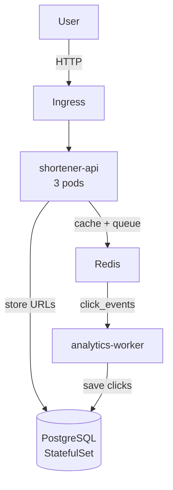
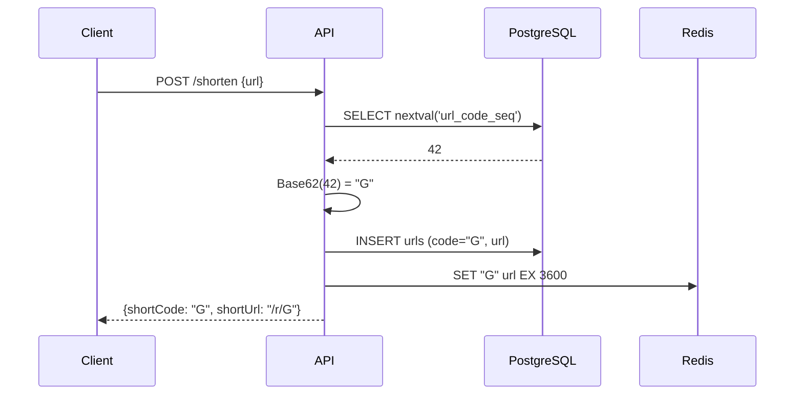
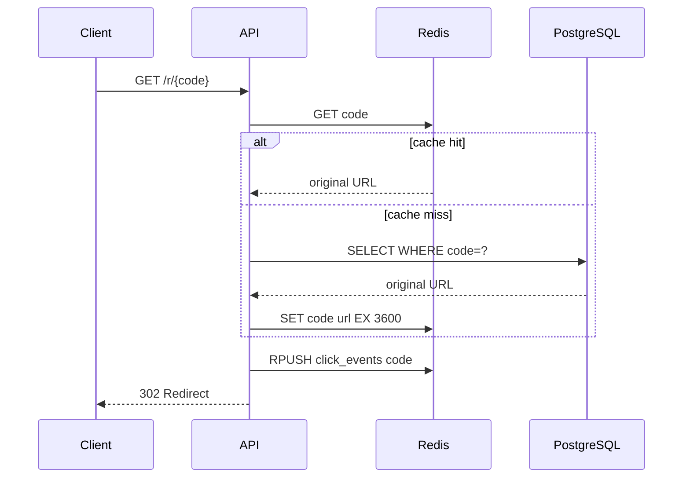
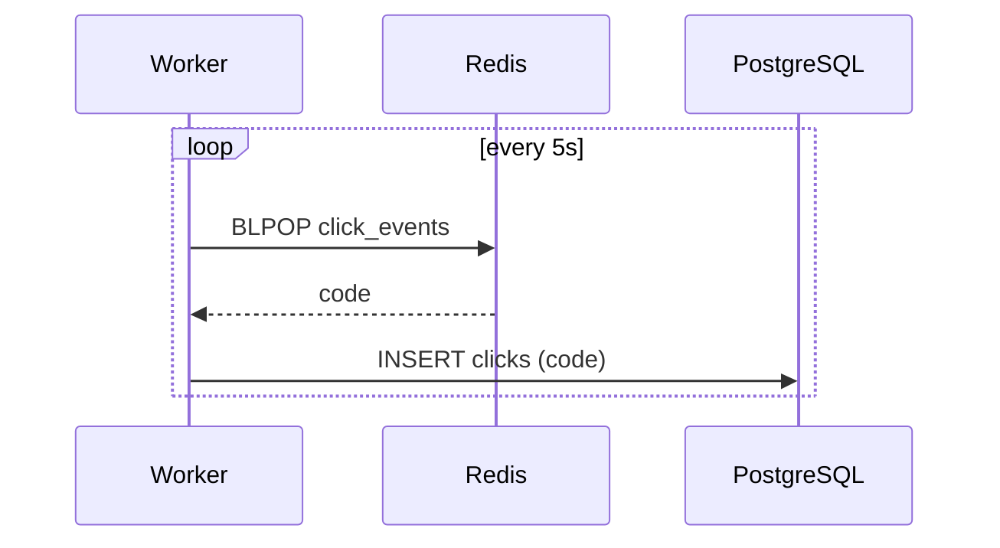

# High Level Design — URL Shortener

## Architecture



---

## Components

| Component | Role |
|-----------|------|
| **shortener-api** | REST API — shortens URLs, handles redirects, pushes click events |
| **analytics-worker** | Background worker — consumes Redis queue, saves clicks to DB |
| **PostgreSQL** | Primary store for URLs and clicks. StatefulSet with 1Gi PVC |
| **Redis** | URL cache (1hr TTL) + click_events queue |
| **Nginx Ingress** | Routes `short.local` → API |

---

## Data Flows

### Shorten a URL



### Redirect



### Analytics



---

## Collision-Free Code Generation

Random codes risk collisions. Instead we use a PostgreSQL atomic sequence + Base62 encoding — same approach as bit.ly.

```
nextval() → 1, 2, 3 ... 56 billion  (atomic, persistent across restarts)
Base62     → "1", "2", "3" ... "ZZzzzz"
```

**Capacity:** 6-char Base62 = 56 billion unique codes.

---

## Key Design Decisions

| Decision | Reason |
|----------|--------|
| PostgreSQL sequence for codes | Atomic across pods and threads — zero collision risk |
| Redis cache on redirect | Avoids DB hit on every click — sub-millisecond reads |
| Redis list for analytics | Decouples click recording from the redirect response |
| StatefulSet for Postgres | Stable identity + data survives pod restarts |
| 3 API replicas + HPA | High availability, auto-scales 3→10 on CPU load |
