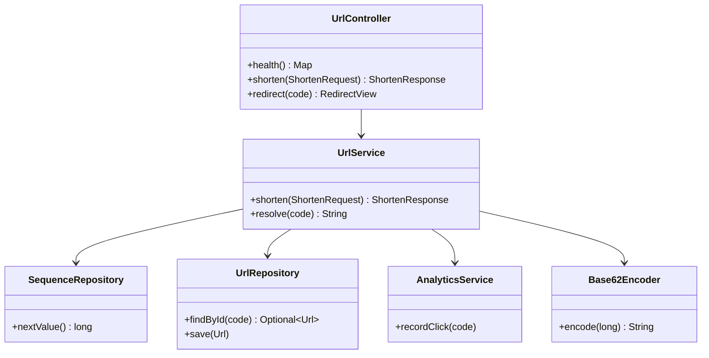
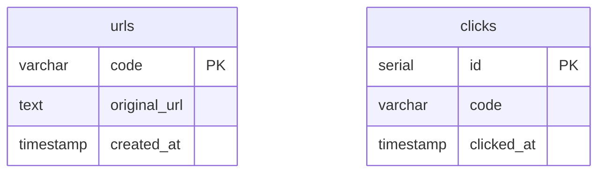

# Low Level Design — URL Shortener

## Class Structure



---

## API Contract

| Method | Path | Request | Response |
|--------|------|---------|---------|
| GET | `/health` | — | `200 {"status":"ok"}` |
| POST | `/shorten` | `{"url":"https://..."}` | `201 {"shortCode":"1","shortUrl":"/r/1"}` |
| GET | `/r/{code}` | — | `302 Location: original URL` |

**Validation on POST /shorten:**
- `url` → `@NotBlank` + `@URL` — returns `400` if invalid

---

## Database Schema



Sequence:
```sql
CREATE SEQUENCE IF NOT EXISTS url_code_seq START WITH 1 INCREMENT BY 1;
```

---

## Redis Usage

| Key | Type | TTL | Set by | Read by |
|-----|------|-----|--------|---------|
| `{code}` | String (URL) | 1 hour | UrlService | UrlService |
| `click_events` | List | None | AnalyticsService | ClickEventWorker |

---

## Base62 Algorithm

Characters: `0-9 a-z A-Z` (62 total)

```
encode(100):
  100 % 62 = 38 → 'c'
  100 / 62 = 1
  1 % 62 = 1  → '1'
  reverse → "1c"
```

| Sequence | Code |
|----------|------|
| 1 | `"1"` |
| 62 | `"10"` |
| 1,000 | `"g8"` |
| 1,000,000 | `"4c92"` |

---

## Test Coverage

| Class | Type | Covers |
|-------|------|--------|
| `UrlControllerTest` | MockMvc | All endpoints, validation, 404 |
| `UrlServiceTest` | Mockito | Shorten, cache hit/miss, 404 |
| `Base62EncoderTest` | Unit | Encoding, edge cases |
| `ClickEventWorkerTest` | Mockito | Save on event, skip when empty |
